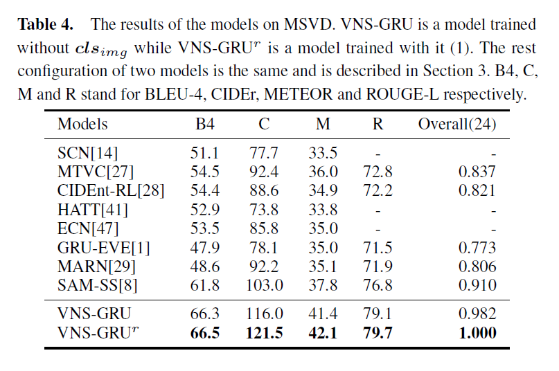
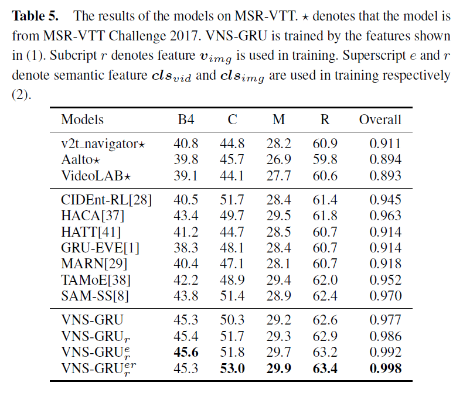

# Delving Deeper into the Decoder for Video Captioning
[](http://makeapullrequest.com) 


## Table of Contents
1. [Description](#description)
2. [Requirement](#requirement)
3. [Manual](#manual)
4. [Results](#results)
    1. [Comparison on Youtube2Text](#cy)
    2. [Comparison on MSR-VTT](#cm)
5. [Data](#data)
6. [Citation](#citation)

## <a name="description"></a> Description
This repository is the source code for the paper named [***Delving Deeper into the Decoder for Video Captioning***](https://arxiv.org/abs/2001.05614).  
The paper has been accepted by [***ECAI 2020***](http://ecai2020.eu/). The encoder-decoder framework is the most popular paradigm for video captioning task. There still exist some non-negligible problems in the decoder of a video captioning model. We propose three methods to improve the performance of the model.
1. A combination of variational dropout and layer normalization is embeded into semantic compositional gated recurrent unit to alleviate the problem of overfitting. 
2. A unified, flexible method is proposed to evaluate the model performance on a validation set so as to select the best checkpoint for testing. 
3. A new training strategy called professional learning is proposed which develops the strong points of a captioning model and bypasses its weaknesses.

It is demonstrated in the experiments of MSVD and MSR-VTT datasets that our model has achieved the best results evaluated by BLEU, CIDEr, METEOR and ROUGE-L metrics with significant gains of up to 11.7% on MSVD and 5% on MSR-VTT compared with the previous state-of-the-art models.

---

If you need more information about how to generate training, validating and testing data for the datasets, please refer to [Semantics-AssistedVideoCaptioning](https://github.com/WingsBrokenAngel/Semantics-AssistedVideoCaptioning).

---


---

## <a name="requirement"></a>Requirement
1. Python 3.6
2. TensorFlow-GPU 1.13
3. pycocoevalcap (Python3)
4. NumPy

## <a name="manual"></a>Manual
1. Make sure you have installed all the required packages.
2. Download files in the [Data section](#data).
3. `cd path_to_directory_of_model; mkdir saves`
4. `run_model.sh` is used for training or testing models.
 Specify the GPU you want to use by modifying `CUDA_VISIBLE_DEVICES` value. `name` will be used in the name of saved model during training. Specify the needed data paths by modifying `corpus`, `ecores`, `tag` and `ref` values. `test` refers to the path of the saved model which is to be tested. Do not give a parameter to `test` if you want to train a model.
5. After completing the configuration of the bash file, then `bash run_model.sh` for training or testing.

---
## <a name="results"></a> Results

### <a name="cy"></a> Comparison on Youtube2Text



### <a name="cm"></a> Comparison on MSR-VTT




---
## <a name="data"></a> Data

### <a name="dmsvd"></a> MSVD
- MSVD dataset and features: [zip file](https://cloud.tsinghua.edu.cn/f/783e3bf2eb8d43748b97/?dl=1)
    * SHA-256 ca86eb2b90e302a4b7f3197065cad3b9be5285905952b95dbffb61cb0bf79e9c
- Model Checkpoint: [zip file](https://cloud.tsinghua.edu.cn/f/ac32b88227d34050b421/?dl=1)
    * SHA-256 64089a49fe9de895c9805a85d50160404cb36ccb8c22a70a32fc7ef5a2abfff1

### <a name="dmsrvtt"></a> MSRVTT
- MSRVTT dataset and features: [zip file](https://cloud.tsinghua.edu.cn/f/2760b68aaf9944649690/?dl=1)
    * SHA-256 611b297c4fbbdd58540373986453a991f285aed6cc18914ad930e1e7646f26fb
- Model Checkpoint: [zip file](https://cloud.tsinghua.edu.cn/f/90ac952f971c4f24994d/?dl=1)
    * SHA-256 fb04fd2d29900f7f8a712b6d2352e8227acd30173274b64a38fcea6a608e4a8e

---

### <a name="citation"></a> Citation
```
@article{chen2020delving,
	title={Delving Deeper into the Decoder for Video Captioning},
	author={Haoran Chen and Jianmin Li and Xiaolin Hu},
	journal={CoRR},
    	archivePrefix={arXiv},
	primaryClass={cs.CV},
	url={https://arxiv.org/abs/2001.05614},
	eprint={2001.05614},
	year={2020}
}
```
